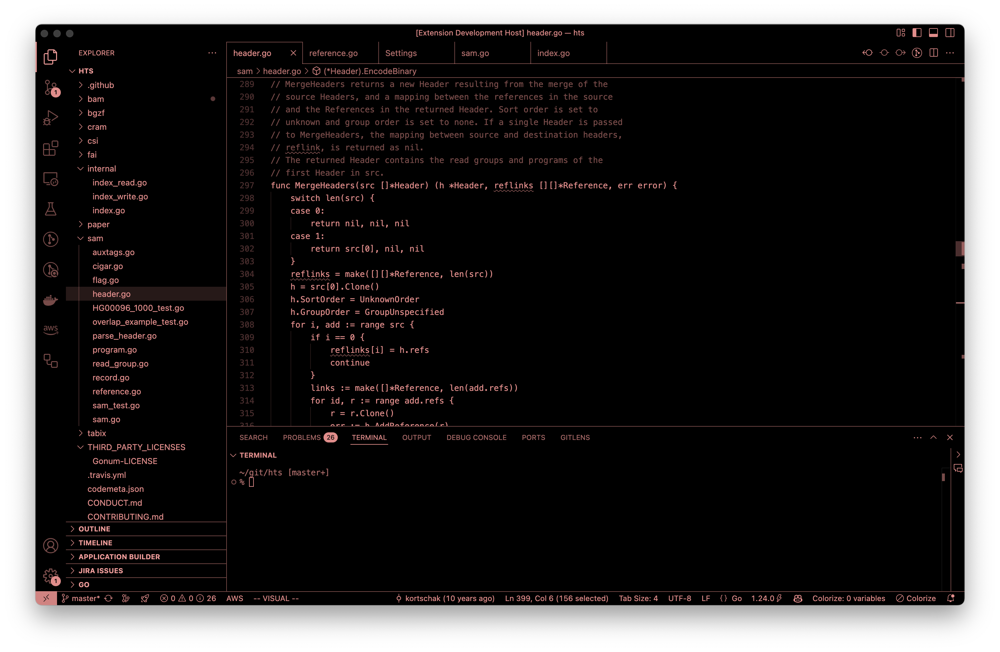

# Scotopic

Monochrome theme that is easy on the eyes when working in the dark.



## Recommended Settings

```json
{
    // built-in
    "editor.bracketPairColorization.enabled": false,
    "explorer.decorations.colors": false,
    "search.decorations.colors": false,
    "workbench.editor.decorations.colors": false,
    // extensions
    "colorize.ruler_decoration": false,
    "todohighlight.defaultStyle": {
        "fontWeight": "bold",
        "color": "lightcoral",
        "border": "1px solid lightcoral",
        "borderRadius": "3px",
        "backgroundColor": "#00000000",
        "isWholeLine": false,
        "overviewRulerColor": "#00000000"
    },
}
```

## Build

Requires Python ≥ 3.11.
- Build themes: `make build`
- Build extension: `make package`
